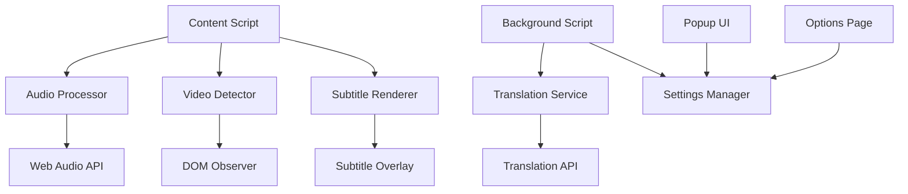

# Design Document

## Overview

The Video Translator Chrome Extension is a browser extension that captures audio from web videos, transcribes speech to text, translates the text, and displays synchronized subtitles. The extension uses Chrome's Web Audio API for audio capture, Web Speech API for transcription, translation services for language conversion, and DOM manipulation for subtitle overlay.

## Architecture

The extension follows a multi-component architecture:



### Core Components

1. **Content Script**: Injected into web pages to detect videos and manage the translation pipeline
2. **Background Script**: Handles translation API calls and manages extension state
3. **Audio Processor**: Captures and processes audio streams from video elements
4. **Video Detector**: Identifies and monitors video elements on the page
5. **Subtitle Renderer**: Creates and positions subtitle overlays
6. **Translation Service**: Interfaces with translation APIs
7. **Settings Manager**: Handles user preferences and configuration

## Components and Interfaces

### Content Script (`content.js`)
- **Purpose**: Main orchestrator running in web page context
- **Responsibilities**:
  - Detect video elements using MutationObserver
  - Initialize audio capture for detected videos
  - Coordinate between audio processing and subtitle rendering
  - Handle user interactions with subtitle controls

**Key Methods**:
```javascript
class VideoTranslator {
  detectVideos()
  initializeAudioCapture(videoElement)
  processAudioStream(audioStream)
  displaySubtitles(translatedText, timestamp)
  handleVideoEvents(videoElement)
}
```

### Audio Processor (`audioProcessor.js`)
- **Purpose**: Handle audio capture and speech recognition
- **Responsibilities**:
  - Create AudioContext from video elements
  - Set up real-time audio analysis
  - Interface with Web Speech API for transcription
  - Manage audio stream lifecycle

**Key Methods**:
```javascript
class AudioProcessor {
  captureAudioFromVideo(videoElement)
  startSpeechRecognition()
  processAudioChunks(audioData)
  handleSpeechResults(transcript)
}
```

### Video Detector (`videoDetector.js`)
- **Purpose**: Identify and monitor video elements
- **Responsibilities**:
  - Use MutationObserver to detect new videos
  - Handle different video element types (video, iframe, custom players)
  - Monitor video state changes (play, pause, seek)

### Subtitle Renderer (`subtitleRenderer.js`)
- **Purpose**: Create and manage subtitle overlays
- **Responsibilities**:
  - Create subtitle DOM elements
  - Position subtitles relative to video
  - Apply user styling preferences
  - Handle subtitle timing and synchronization

### Background Script (`background.js`)
- **Purpose**: Handle extension lifecycle and API calls
- **Responsibilities**:
  - Manage translation API requests
  - Store and retrieve user settings
  - Handle extension icon state
  - Coordinate between content scripts and popup

### Translation Service (`translationService.js`)
- **Purpose**: Interface with translation APIs
- **Responsibilities**:
  - Send text to translation service
  - Handle API rate limiting and errors
  - Cache common translations
  - Support multiple translation providers

## Data Models

### VideoInstance
```javascript
{
  id: string,
  element: HTMLVideoElement,
  audioContext: AudioContext,
  isActive: boolean,
  currentSubtitle: SubtitleItem,
  settings: VideoSettings
}
```

### SubtitleItem
```javascript
{
  id: string,
  originalText: string,
  translatedText: string,
  startTime: number,
  endTime: number,
  confidence: number,
  speaker?: string
}
```

### UserSettings
```javascript
{
  targetLanguage: string,
  sourceLanguage: string,
  subtitleStyle: {
    fontSize: number,
    fontColor: string,
    backgroundColor: string,
    position: 'bottom' | 'top' | 'center'
  },
  isEnabled: boolean,
  autoDetectLanguage: boolean
}
```

### TranslationRequest
```javascript
{
  text: string,
  sourceLanguage: string,
  targetLanguage: string,
  timestamp: number,
  videoId: string
}
```

## Error Handling

### Audio Capture Errors
- **MediaStreamError**: Handle cases where audio capture is blocked
- **AudioContextError**: Manage Web Audio API initialization failures
- **Fallback Strategy**: Attempt alternative audio capture methods

### Translation Errors
- **API Rate Limiting**: Implement exponential backoff and request queuing
- **Network Failures**: Cache and retry failed translation requests
- **Invalid Language Codes**: Validate language selections and provide fallbacks

### Speech Recognition Errors
- **No Speech Detected**: Display appropriate user feedback
- **Recognition Timeout**: Implement retry logic with user notification
- **Low Confidence Results**: Mark uncertain transcriptions for user review

### Cross-Origin Restrictions
- **CORS Issues**: Handle cases where video audio cannot be accessed
- **Iframe Restrictions**: Implement alternative detection methods for embedded content
- **Security Policies**: Respect Content Security Policy restrictions

## Testing Strategy

### Unit Testing
- **Audio Processing**: Mock Web Audio API and test audio stream handling
- **Translation Service**: Mock API responses and test error scenarios
- **Subtitle Rendering**: Test DOM manipulation and positioning logic
- **Settings Management**: Test preference storage and retrieval

### Integration Testing
- **End-to-End Flow**: Test complete translation pipeline from audio to subtitles
- **Cross-Browser Compatibility**: Verify functionality across Chrome versions
- **Website Compatibility**: Test with major video platforms (YouTube, Netflix, etc.)

### Performance Testing
- **Memory Usage**: Monitor extension memory consumption during long sessions
- **CPU Impact**: Measure processing overhead on video playback
- **Translation Latency**: Ensure subtitles appear within acceptable timeframes

### Security Testing
- **Permission Validation**: Verify extension only accesses necessary resources
- **Data Privacy**: Ensure no sensitive audio data is stored or transmitted inappropriately
- **Content Script Isolation**: Test that extension doesn't interfere with page functionality

## Implementation Considerations

### Chrome Extension Manifest V3
- Use service workers instead of background pages
- Implement proper permission declarations for audio access
- Handle dynamic content script injection

### Real-time Processing
- Implement efficient audio buffering to minimize latency
- Use Web Workers for CPU-intensive translation processing
- Optimize DOM updates to prevent video performance impact

### User Experience
- Provide clear visual indicators of extension status
- Implement smooth subtitle animations and transitions
- Ensure accessibility compliance for subtitle rendering

### Scalability
- Design for multiple simultaneous video translations
- Implement efficient resource cleanup when videos are removed
- Handle high-frequency subtitle updates without performance degradation